# found-300-youtube

**300 YouTube tutorials classified onto the 32 star-list topics. A visual watching list, not a trophy case.**

Companion to [`found-300`](https://github.com/ahmaddroobi99/found-300) (GitHub repos) and [`starred-topics`](https://github.com/ahmaddroobi99/starred-topics).

This catalog is the **YouTube layer**: ~9 tutorials per list, plus a short extra block for music-recommendation work from the 2026-09-18 conversation. Research first. Undergraduate last.

> Stars are a reading list. These videos are the watching list that sits next to it.

## How this catalog was built

There is no private six-month Grok chat export to mine. Topic discovery used:

1. The **32 GitHub star lists** on this account (the working taxonomy since 2026-09).
2. Recent public repos from Mar–Sep 2026: SciML / Lagrangian DA, perception, Physical AI, CAD, world models, on-device inference.
3. This conversation: YouTube/SoundCloud plugins, music recommendation algorithms, then this catalog request.

We cannot write YouTube playlists into a YouTube account. This README *is* the organized playlist.

Machine-readable copy: [`catalog/videos.txt`](catalog/videos.txt).

---

## Map of the lists

```mermaid
flowchart TB
  S[found-300-youtube] --> F[Fundamentals]
  S --> G[Geometry / CAD]
  S --> V[Vision / 3D]
  S --> R[Robots / control / sim]
  S --> I[Inference / serving / data]
  F --> F1[Python]
  F --> F2[C++]
  F --> F3[Linux]
  F --> F4[CUDA]
  F --> F5[LinAlg]
  F --> F6[Algos]
  F --> F7[Git]
  F --> F8[Testing]
  F --> F9[Embedded]
  F --> F10[Backend]
  G --> G1[Code CAD]
  G --> G2[Kernels]
  G --> G3[BIM]
  G --> G4[CAD learning]
  G --> G5[Comp geom]
  V --> V1[Vision+CUDA]
  V --> V2[3D / points]
  V --> V3[CV basics]
  V --> V4[Neural rendering]
  V --> V5[World models]
  V --> V6[Deep learning]
  R --> R1[Physical AI]
  R --> R2[Diff sim]
  R --> R3[Sensors]
  R --> R4[Control]
  R --> R5[Tracking]
  R --> R6[OpenUSD]
  R --> R7[Sim / optics]
  I --> I1[Compile]
  I --> I2[Serving]
  I --> I3[LLM + gen CAD]
  I --> I4[Vector DBs]
```

---

## Table of contents

1. [3D Vision and Point Clouds](#1--3d-vision-and-point-clouds)
2. [Algorithms and Data Structures](#2--algorithms-and-data-structures)
3. [Backend and API Infrastructure](#3--backend-and-api-infrastructure)
4. [C++ Fundamentals](#4--c-fundamentals)
5. [CAD/BIM Parsing and Review](#5--cadbim-parsing-and-review)
6. [CAD Kernels and B-Rep](#6--cad-kernels-and-b-rep)
7. [CAD Representation Learning](#7--cad-representation-learning)
8. [Code CAD and Parametric Modeling](#8--code-cad-and-parametric-modeling)
9. [Computational Geometry and Mesh Processing](#9--computational-geometry-and-mesh-processing)
10. [Computer Vision Basics](#10--computer-vision-basics)
11. [Control Systems and Robotics](#11--control-systems-and-robotics)
12. [CUDA and GPU Basics](#12--cuda-and-gpu-basics)
13. [Deep Learning](#13--deep-learning)
14. [Differentiable Simulation and Sim-to-Real](#14--differentiable-simulation-and-sim-to-real)
15. [Embedded and Real-Time C++](#15--embedded-and-real-time-c)
16. [Git Build and Tooling](#16--git-build-and-tooling)
17. [Linear Algebra and Math](#17--linear-algebra-and-math)
18. [Linux and Systems](#18--linux-and-systems)
19. [LLM Agents and Generative CAD](#19--llm-agents-and-generative-cad)
20. [Model Compilation and On-Device Inference](#20--model-compilation-and-on-device-inference)
21. [Neural Rendering and Gaussian Splatting](#21--neural-rendering-and-gaussian-splatting)
22. [OpenUSD and Industrial Scene Graphs](#22--openusd-and-industrial-scene-graphs)
23. [Physical AI and Robot Foundation Models](#23--physical-ai-and-robot-foundation-models)
24. [Production Multimodal Serving](#24--production-multimodal-serving)
25. [Python Fundamentals](#25--python-fundamentals)
26. [Robotics and Sensors](#26--robotics-and-sensors)
27. [Simulation and Optics](#27--simulation-and-optics)
28. [Testing and Software Design](#28--testing-and-software-design)
29. [Tracking and Estimation](#29--tracking-and-estimation)
30. [Vector Databases and Data Platforms](#30--vector-databases-and-data-platforms)
31. [Vision and CUDA](#31--vision-and-cuda)
32. [World Models and Spatial Intelligence](#32--world-models-and-spatial-intelligence)
33. [Extra · Music recommendation (this thread)](#33--extra--music-recommendation-this-thread)

---

## Catalog

Each table is **~9 tutorials** for that list. Prefer lectures and worked pipelines over shorts.

### 1 · 3D Vision and Point Clouds

Feed-forward geometry, Open3D, COLMAP, LiDAR clouds.

| # | Tutorial | Channel | URL | Why |
| --- | --- | --- | --- | --- |
| 1 | Point Cloud Processing with Open3D | Nicolai Nielsen | https://www.youtube.com/watch?v=zF3MreN1w6c | Open3D on-ramp |
| 2 | Voxel downsampling and normals | Nicolai Nielsen | https://www.youtube.com/watch?v=bRL4BO9WMbM | Standard preprocess |
| 3 | Basic point-cloud processing | Nicolai Nielsen | https://www.youtube.com/watch?v=2bVdvgzYLeQ | Core operators |
| 4 | Depth maps to point clouds | Nicolai Nielsen | https://www.youtube.com/watch?v=teHGdlGhQZo | RGB-D → cloud |
| 5 | ICP with Open3D | Nicolai Nielsen | https://www.youtube.com/watch?v=CzbETzWgFrc | Registration |
| 6 | Global registration | Nicolai Nielsen | https://www.youtube.com/watch?v=cjSPf7OMx4w | Coarse align |
| 7 | Automated COLMAP tracking | Polyfjord | https://www.youtube.com/watch?v=xx85eyN1Xc0 | SfM camera path |
| 8 | Open3D Python playlist | Nicolai Nielsen | https://www.youtube.com/playlist?list=PLkmvobsnE0GEZugH1Di2Cr_f32qYkv7aN | Full series |
| 9 | Phone LiDAR → Open3D | Nicolai Nielsen | https://www.youtube.com/watch?v=9heI3BTx9fc | Handheld capture |

### 2 · Algorithms and Data Structures

Readable implementations and interview-grade tracks.

| # | Tutorial | Channel | URL | Why |
| --- | --- | --- | --- | --- |
| 1 | Algorithms course (freeCodeCamp) | freeCodeCamp | https://www.youtube.com/watch?v=8hly31xKli0 | Long-form DS/algos |
| 2 | Data structures easy to advanced | freeCodeCamp | https://www.youtube.com/watch?v=RBSGKlA2b-0 | Structured DS pass |
| 3 | Graph algorithms | freeCodeCamp | https://www.youtube.com/watch?v=tWVWeAqZ0WU | Graphs |
| 4 | Dynamic programming | freeCodeCamp | https://www.youtube.com/watch?v=oBt53YbR9Kk | DP catalog |
| 5 | MIT 6.006 Intro to Algorithms | MIT OCW | https://www.youtube.com/playlist?list=PLUl4u3cNGP61Oq3tWYp6V_F-5jb5d2BZO | Course lectures |
| 6 | Abstraction, Recursion, Trees | MIT 6.0001 | https://www.youtube.com/watch?v=WPSeyjX1-4s | Recursion |
| 7 | Big-O notation | CS Dojo | https://www.youtube.com/watch?v=D6xkbjQ7jkU | Complexity |
| 8 | Binary search | CS Dojo | https://www.youtube.com/watch?v=D5SrAga1Tso | Search |
| 9 | Hash tables | CS Dojo | https://www.youtube.com/watch?v=shs0KM3wKv8 | Maps |

### 3 · Backend and API Infrastructure

HTTP, RPC, queues, gateways.

| # | Tutorial | Channel | URL | Why |
| --- | --- | --- | --- | --- |
| 1 | FastAPI full course | freeCodeCamp | https://www.youtube.com/watch?v=0sOvCWFmrtA | Python API default |
| 2 | gRPC explained | IBM Technology | https://www.youtube.com/watch?v=hKQ9Wb2mCl4 | RPC |
| 3 | Kafka in 100 seconds | Fireship | https://www.youtube.com/watch?v=uvb00oaa3k8 | Log bus |
| 4 | Redis crash course | Traversy Media | https://www.youtube.com/watch?v=jgpVdJB2sKQ | Cache + streams |
| 5 | Nginx crash course | Traversy Media | https://www.youtube.com/watch?v=7VAI73roXaY | Reverse proxy |
| 6 | Docker + Compose | NetworkChuck | https://www.youtube.com/watch?v=eGz9DS-aIeY | Ship the API |
| 7 | REST API design | freeCodeCamp | https://www.youtube.com/watch?v=-MTSQjw5DrM | HTTP design |
| 8 | PostgreSQL tutorial | freeCodeCamp | https://www.youtube.com/watch?v=qw--VYLpxG4 | Datastore |
| 9 | System design primer talk | InfoQ / related | https://www.youtube.com/watch?v=sqc6N9BkM-k | Backend shape |

### 4 · C++ Fundamentals

Libraries you link and the language under them.

| # | Tutorial | Channel | URL | Why |
| --- | --- | --- | --- | --- |
| 1 | C++ playlist | The Cherno | https://www.youtube.com/playlist?list=PLlrATfBNZ98dudnM48yfGUldqGD0S4FFb | Canonical series |
| 2 | Welcome to OpenGL | The Cherno | https://www.youtube.com/watch?v=W3gAzLwfIP0 | Graphics C++ |
| 3 | Setting up OpenGL | The Cherno | https://www.youtube.com/watch?v=OR4fNpBjmq8 | Window + context |
| 4 | C++ full course | freeCodeCamp | https://www.youtube.com/watch?v=8jLOx1hD3_o | Long-form |
| 5 | C++ pointers | The Cherno | https://www.youtube.com/watch?v=DTxHyVn0ODg | Memory |
| 6 | C++ references | The Cherno | https://www.youtube.com/watch?v=Iujo9_b3a0I | Aliasing |
| 7 | C++ classes | The Cherno | https://www.youtube.com/watch?v=2BP8NhcvOt4 | OOP |
| 8 | Smart pointers | The Cherno | https://www.youtube.com/watch?v=UOB7-B2MfwA | RAII |
| 9 | CppCon back to basics | CppCon | https://www.youtube.com/playlist?list=PLHTh1InhhwT7RoO1Wocfz_lht-K1Bmtqm | Conference track |

### 5 · CAD/BIM Parsing and Review

IFC, scan-to-BIM, energy lineage.

| # | Tutorial | Channel | URL | Why |
| --- | --- | --- | --- | --- |
| 1 | LiDAR scan → CAD/BIM apartment | Payo | https://www.youtube.com/watch?v=muptvgmeJzk | Scan-to-BIM |
| 2 | IfcOpenShell intro (search official talks) | OSArch / BIM | https://www.youtube.com/results?search_query=IfcOpenShell+tutorial | IFC parser |
| 3 | OpenStudio beginner | NREL / EnergyPlus | https://www.youtube.com/results?search_query=OpenStudio+beginner+tutorial | Building energy |
| 4 | Speckle getting started | Speckle | https://www.youtube.com/results?search_query=Speckle+getting+started+tutorial | AEC data platform |
| 5 | xeokit BIM viewer | xeokit | https://www.youtube.com/results?search_query=xeokit+BIM+viewer+tutorial | Web IFC |
| 6 | Revit IFC export | Autodesk | https://www.youtube.com/results?search_query=Revit+IFC+export+tutorial | Interchange |
| 7 | Ladybug / Honeybee | Ladybug Tools | https://www.youtube.com/results?search_query=Ladybug+Honeybee+tutorial | Climate on BIM |
| 8 | FreeCAD BIM workbench | FreeCAD | https://www.youtube.com/results?search_query=FreeCAD+BIM+workbench+tutorial | Desktop BIM |
| 9 | BricsCAD BIM solids | Bricsys | https://www.youtube.com/results?search_query=BricsCAD+BIM+tutorial | Solids + classify |

### 6 · CAD Kernels and B-Rep

OCCT, CadQuery, FreeCAD kernel layer.

| # | Tutorial | Channel | URL | Why |
| --- | --- | --- | --- | --- |
| 1 | Intro to CadQuery | MedicationForAll | https://www.youtube.com/watch?v=m3xIwvSixP0 | Pythonic B-Rep |
| 2 | Install CadQuery on Windows | MedicationForAll | https://www.youtube.com/watch?v=eFhJxFA6nU0 | Env |
| 3 | CQ-editor + CadQuery | MedicationForAll | https://www.youtube.com/watch?v=hOI59pELF8A | GUI |
| 4 | Shape primitives | MedicationForAll | https://www.youtube.com/watch?v=X_zRQkol7vI | Solids |
| 5 | Workplane and the stack | MedicationForAll | https://www.youtube.com/watch?v=iTZkvPx5D1g | CadQuery model |
| 6 | CadQuery playlist | MedicationForAll | https://www.youtube.com/playlist?list=PLp3CH9TgV357ptOandoUOqoWMmQ2zRgyD | Full series |
| 7 | FreeCAD Part Design | Joko Engineering | https://www.youtube.com/results?search_query=FreeCAD+Part+Design+tutorial+Joko | Desktop OCCT |
| 8 | Open CASCADE overview | Open Cascade | https://www.youtube.com/results?search_query=Open+CASCADE+OCCT+tutorial | Kernel |
| 9 | SolveSpace constraints | SolveSpace | https://www.youtube.com/results?search_query=SolveSpace+tutorial | Constraint CAD |

### 7 · CAD Representation Learning

Text/sketch-to-CAD and B-Rep nets.

| # | Tutorial | Channel | URL | Why |
| --- | --- | --- | --- | --- |
| 1 | CadQuery vs OpenSCAD for agents | ModelRift context | https://www.youtube.com/results?search_query=text+to+CAD+tutorial | Gen CAD framing |
| 2 | DeepCAD / CAD generation papers | Two Minute Papers / talks | https://www.youtube.com/results?search_query=DeepCAD+CAD+generation+tutorial | Sequence CAD |
| 3 | ABC dataset overview | research talks | https://www.youtube.com/results?search_query=ABC+dataset+CAD+tutorial | Big CAD data |
| 4 | BRepNet talk | Autodesk AI Lab | https://www.youtube.com/results?search_query=BRepNet+Autodesk+tutorial | Topology nets |
| 5 | UV-Net talk | Autodesk AI Lab | https://www.youtube.com/results?search_query=UV-Net+CAD+tutorial | UV-grid solids |
| 6 | Scan2CAD | research talks | https://www.youtube.com/results?search_query=Scan2CAD+tutorial | Align scan to CAD |
| 7 | Text-to-CAD workflows | Zoo / KittyCAD | https://www.youtube.com/results?search_query=Zoo+Design+Studio+text+to+CAD | Productized gen CAD |
| 8 | Fusion 360 Gallery dataset | Autodesk | https://www.youtube.com/results?search_query=Fusion+360+Gallery+dataset | Reconstruction data |
| 9 | Image-to-3D (TripoSR / Shap-E) | research / HF | https://www.youtube.com/results?search_query=TripoSR+tutorial | Fast 3D gen |

### 8 · Code CAD and Parametric Modeling

OpenSCAD, CadQuery, programmable solids.

| # | Tutorial | Channel | URL | Why |
| --- | --- | --- | --- | --- |
| 1 | Intro to CadQuery | MedicationForAll | https://www.youtube.com/watch?v=m3xIwvSixP0 | Code CAD |
| 2 | OpenSCAD tutorial part 1 | John's Basement | https://www.youtube.com/results?search_query=OpenSCAD+Tutorial+Part+1+John%27s+Basement | CSG on-ramp |
| 3 | Getting started with CAD for printing | MakeWithTech | https://www.youtube.com/results?search_query=Getting+Started+with+CAD+Modeling+for+3D+Printing+MakeWithTech | Tool map |
| 4 | CadQuery primitives | MedicationForAll | https://www.youtube.com/watch?v=X_zRQkol7vI | Solids |
| 5 | CadQuery workplane | MedicationForAll | https://www.youtube.com/watch?v=iTZkvPx5D1g | Stack |
| 6 | BOSL2 / OpenSCAD libraries | BelfrySCAD | https://www.youtube.com/results?search_query=BOSL2+OpenSCAD+tutorial | Standard lib |
| 7 | Gridfinity parametric | community | https://www.youtube.com/results?search_query=Gridfinity+OpenSCAD+tutorial | Parametric storage |
| 8 | JSCAD intro | JSCAD | https://www.youtube.com/results?search_query=OpenJSCAD+tutorial | JS CAD |
| 9 | CadQuery series | MedicationForAll | https://www.youtube.com/playlist?list=PLp3CH9TgV357ptOandoUOqoWMmQ2zRgyD | Playlist |

### 9 · Computational Geometry and Mesh Processing

Meshes, reconstruction, processing libraries.

| # | Tutorial | Channel | URL | Why |
| --- | --- | --- | --- | --- |
| 1 | MeshLab basics | CNR ISTI / community | https://www.youtube.com/results?search_query=MeshLab+tutorial+basics | Desktop mesh |
| 2 | Poisson reconstruction | research / MeshLab | https://www.youtube.com/results?search_query=Poisson+surface+reconstruction+tutorial | Surface from clouds |
| 3 | CGAL overview | CGAL Project | https://www.youtube.com/results?search_query=CGAL+tutorial | Comp geom library |
| 4 | libigl tutorial | libigl | https://www.youtube.com/results?search_query=libigl+tutorial | Geometry processing |
| 5 | PyVista mesh | PyVista | https://www.youtube.com/results?search_query=PyVista+tutorial | Python viz |
| 6 | TetWild / fTetWild | research talks | https://www.youtube.com/results?search_query=TetWild+meshing+tutorial | Robust tets |
| 7 | Open3D mesh from clouds | Nicolai Nielsen | https://www.youtube.com/watch?v=zF3MreN1w6c | Cloud → surface |
| 8 | Draco compression | Google | https://www.youtube.com/results?search_query=Google+Draco+mesh+compression+tutorial | Compress |
| 9 | Kaolin 3D DL | NVIDIA | https://www.youtube.com/results?search_query=NVIDIA+Kaolin+tutorial | Differentiable mesh |

### 10 · Computer Vision Basics

Detectors, segmenters, first principles.

| # | Tutorial | Channel | URL | Why |
| --- | --- | --- | --- | --- |
| 1 | What is Computer Vision? | Shree Nayar | https://www.youtube.com/watch?v=wVE8SFMSBJ0 | First principles |
| 2 | Image formation overview | Shree Nayar | https://www.youtube.com/watch?v=_QjxbQKY4ds | Cameras |
| 3 | Edge / boundary / SIFT playlist | Shree Nayar | https://www.youtube.com/playlist?list=PL2zRqk16wsdqXEMpHrc4Qnb5rA1Cylrhx | Classic CV |
| 4 | YOLOv8 workflows | Ultralytics | https://www.youtube.com/watch?v=_fr4fAMgF_Y | Detect / train / export |
| 5 | YOLOv8 segmentation | Ultralytics | https://www.youtube.com/watch?v=o4Zd-IeMlSY | Masks |
| 6 | YOLO quickstart | Ultralytics | https://www.youtube.com/watch?v=_a7cVL9hqnk | pip install path |
| 7 | YOLO CLI + Python | Ultralytics | https://www.youtube.com/watch?v=GsXGnb-A4Kc | Two APIs |
| 8 | Ultralytics YOLOv8 playlist | Ultralytics | https://www.youtube.com/playlist?list=PL1FZnkj4ad1PFJTjW4mWpHZhzgJinkNV0 | Full line |
| 9 | CS231n 2017 playlist | Stanford | https://www.youtube.com/playlist?list=PL3FW7Lu3i5JvHM8ljYj-zLfQRF3EO8sYv | Course |

### 11 · Control Systems and Robotics

MPC, ros2_control, classical control.

| # | Tutorial | Channel | URL | Why |
| --- | --- | --- | --- | --- |
| 1 | Control Bootcamp playlist | Steve Brunton | https://www.youtube.com/playlist?list=PLMrJAkhIeNNR20Mz-VpzgfQs5zrYi085m | LQR / state space |
| 2 | ros2_control concepts | Articulated Robotics | https://www.youtube.com/watch?v=4QKsDf1c4hc | Every robot's problem |
| 3 | ros2_control on hardware | Articulated Robotics | https://www.youtube.com/watch?v=4VVrTCnxvSw | Real robot |
| 4 | Any hardware with ros2_control | Articulated Robotics | https://www.youtube.com/watch?v=J02jEKawE5U | Hardware interface |
| 5 | URDF | Articulated Robotics | https://www.youtube.com/watch?v=CwdbsvcpOHM | Robot description |
| 6 | Gazebo + ROS | Articulated Robotics | https://www.youtube.com/watch?v=laWn7_cj434 | Sim |
| 7 | Rotation matrix | Articulated Robotics | https://www.youtube.com/watch?v=8GrdqAizcfU | SO(3) |
| 8 | Motors in robotics | Articulated Robotics | https://www.youtube.com/watch?v=-PCuDnpgiew | Actuation |
| 9 | Building a mobile robot playlist | Articulated Robotics | https://www.youtube.com/playlist?list=PLunhqkrRNRhYAffV8JDiFOatQXuU-NnxT | Full build |

### 12 · CUDA and GPU Basics

Kernels, memory, official toolkit.

| # | Tutorial | Channel | URL | Why |
| --- | --- | --- | --- | --- |
| 1 | CUDA vector addition | Nick | https://www.youtube.com/watch?v=2NgpYFdsduY | First kernel |
| 2 | CUDA matrix multiplication | Nick | https://www.youtube.com/watch?v=XEOc4HCf_pQ | GEMM |
| 3 | Cache-tiled GEMM | Nick | https://www.youtube.com/watch?v=3xfyiWhtvZw | Shared memory |
| 4 | Why coalescing matters | Nick | https://www.youtube.com/watch?v=_qSP455IekE | Memory |
| 5 | CUDA crash-course playlist | Nick | https://www.youtube.com/playlist?list=PLxNPSjHT5qvtYRVdNN1yDcdSl39uHV_sU | Series |
| 6 | Install CUDA Toolkit | NVIDIA Developer | https://www.youtube.com/watch?v=JaHVsZa2jTc | Windows / WSL |
| 7 | Getting started with CUDA | NVIDIA Developer | https://www.youtube.com/watch?v=GmNkYayuaA4 | GTC session |
| 8 | Profiling and debugging | NVIDIA Developer | https://www.youtube.com/watch?v=dB5Jxwj0PDw | Nsight |
| 9 | CUDA trainings playlist | NVIDIA Developer | https://www.youtube.com/playlist?list=PL5B692fm6--vScfBaxgY89IRWFzDt0Khm | Official |

### 13 · Deep Learning

From backprop to GPT.

| # | Tutorial | Channel | URL | Why |
| --- | --- | --- | --- | --- |
| 1 | micrograd / backprop | Andrej Karpathy | https://www.youtube.com/watch?v=VMj-3S1tku0 | Autograd from scratch |
| 2 | makemore bigram LM | Andrej Karpathy | https://www.youtube.com/watch?v=PaCmpygFfXo | Language modeling |
| 3 | makemore MLP | Andrej Karpathy | https://www.youtube.com/watch?v=TCH_1BHY58I | Embeddings |
| 4 | Activations, BatchNorm | Andrej Karpathy | https://www.youtube.com/watch?v=P6sfmUTpUmc | Training dynamics |
| 5 | Backprop ninja | Andrej Karpathy | https://www.youtube.com/watch?v=q8SA3rM6ckI | Manual grads |
| 6 | WaveNet | Andrej Karpathy | https://www.youtube.com/watch?v=t3YJ5hKiMQ0 | Dilated conv LM |
| 7 | Build GPT from scratch | Andrej Karpathy | https://www.youtube.com/watch?v=kCc8FmEb1nY | Transformer |
| 8 | GPT tokenizer | Andrej Karpathy | https://www.youtube.com/watch?v=zduSFxRajkE | BPE |
| 9 | Reproduce GPT-2 | Andrej Karpathy | https://www.youtube.com/watch?v=l8pRSuU81PU | Training at scale |

### 14 · Differentiable Simulation and Sim-to-Real

Physics in the loop, domain randomization.

| # | Tutorial | Channel | URL | Why |
| --- | --- | --- | --- | --- |
| 1 | Sim-to-real humanoids in 3DGS | NVIDIA Omniverse | https://www.youtube.com/watch?v=1XtBPY4i780 | Real-to-sim |
| 2 | Train a robot URDF → OpenUSD | NVIDIA Omniverse | https://www.youtube.com/watch?v=_HMk7I-vSBQ | Isaac Lab path |
| 3 | Isaac Sim + OpenUSD | NVIDIA Omniverse | https://www.youtube.com/watch?v=xzadqDxKue8 | Physical AI sim |
| 4 | PINNs introduction | Steve Brunton | https://www.youtube.com/watch?v=-zrY7P2dVC4 | Physics in the loss |
| 5 | PINNs hands-on | Vizuara | https://www.youtube.com/watch?v=zjH8imO-UWo | Project course |
| 6 | PINNs + neural DEs | APS | https://www.youtube.com/watch?v=8UrbgEStLA8 | SciML pair |
| 7 | MuJoCo overview | DeepMind / community | https://www.youtube.com/results?search_query=MuJoCo+tutorial+Isaac | Contact-rich |
| 8 | Isaac Lab RL | NVIDIA | https://www.youtube.com/results?search_query=Isaac+Lab+reinforcement+learning+tutorial | Policy training |
| 9 | Domain randomization | robotics talks | https://www.youtube.com/results?search_query=domain+randomization+sim+to+real+tutorial | Transfer |

### 15 · Embedded and Real-Time C++

On-robot, RTOS, firmware.

| # | Tutorial | Channel | URL | Why |
| --- | --- | --- | --- | --- |
| 1 | Motors + Raspberry Pi | Articulated Robotics | https://www.youtube.com/watch?v=-PCuDnpgiew | Embedded actuation |
| 2 | ros2_control hardware | Articulated Robotics | https://www.youtube.com/watch?v=J02jEKawE5U | Real-time control loop |
| 3 | Embedded C++ playlist | The Cherno / related | https://www.youtube.com/results?search_query=embedded+C%2B%2B+tutorial+real+time | Language subset |
| 4 | FreeRTOS intro | FreeRTOS / AWS | https://www.youtube.com/results?search_query=FreeRTOS+tutorial+intro | RTOS |
| 5 | STM32 bare metal | controllers | https://www.youtube.com/results?search_query=STM32+bare+metal+C%2B%2B+tutorial | MCU |
| 6 | Jetson GPIO / camera | NVIDIA | https://www.youtube.com/results?search_query=Jetson+camera+GPIO+tutorial | Edge board |
| 7 | PX4 intro | PX4 | https://www.youtube.com/results?search_query=PX4+autopilot+tutorial | Flight stack |
| 8 | Crazyflie firmware | Bitcraze | https://www.youtube.com/results?search_query=Crazyflie+firmware+tutorial | Quadrotor FW |
| 9 | Unitree SDK | Unitree | https://www.youtube.com/results?search_query=Unitree+SDK2+tutorial | Vendor robot |

### 16 · Git Build and Tooling

Version control, CMake, CI.

| # | Tutorial | Channel | URL | Why |
| --- | --- | --- | --- | --- |
| 1 | Git and GitHub for beginners | freeCodeCamp | https://www.youtube.com/watch?v=RGOj5yH7evk | On-ramp |
| 2 | Git intern | Fireship | https://www.youtube.com/watch?v=hwP7WQkmECE | Mental model |
| 3 | CMake tutorial | Kitware / community | https://www.youtube.com/results?search_query=CMake+tutorial+official | Build graphs |
| 4 | Make vs CMake | various | https://www.youtube.com/results?search_query=Makefile+vs+CMake+tutorial | Build |
| 5 | GitHub Actions | GitHub | https://www.youtube.com/results?search_query=GitHub+Actions+tutorial | CI |
| 6 | Pre-commit + clang-format | community | https://www.youtube.com/results?search_query=clang-format+pre-commit+tutorial | Hygiene |
| 7 | Ninja build | community | https://www.youtube.com/results?search_query=Ninja+build+system+tutorial | Fast builds |
| 8 | vcpkg / Conan | Microsoft / community | https://www.youtube.com/results?search_query=vcpkg+tutorial+C%2B%2B | Deps |
| 9 | Debugging with GDB | various | https://www.youtube.com/results?search_query=GDB+tutorial | Debug |

### 17 · Linear Algebra and Math

Geometry of matrices.

| # | Tutorial | Channel | URL | Why |
| --- | --- | --- | --- | --- |
| 1 | Essence of linear algebra playlist | 3Blue1Brown | https://www.youtube.com/playlist?list=PLZHQObOWTQDPD3MizzM2xVFitgF8hE_ab | The series |
| 2 | Vectors | 3Blue1Brown | https://www.youtube.com/watch?v=fNk_zzaMoSs | Ch.1 |
| 3 | Span and basis | 3Blue1Brown | https://www.youtube.com/watch?v=k7RM-ot2NWY | Ch.2 |
| 4 | Linear transformations | 3Blue1Brown | https://www.youtube.com/watch?v=kYB8IZa5AuE | Ch.3 |
| 5 | Matrix multiplication | 3Blue1Brown | https://www.youtube.com/watch?v=XkY2DOUCWMU | Ch.4 |
| 6 | 3D transformations | 3Blue1Brown | https://www.youtube.com/watch?v=rHLEWRxRGiM | Ch.5 |
| 7 | Determinant | 3Blue1Brown | https://www.youtube.com/watch?v=Ip3X9LOh2dk | Ch.6 |
| 8 | Inverse / column space | 3Blue1Brown | https://www.youtube.com/watch?v=uQhTuRlWMxw | Ch.7 |
| 9 | Eigenvectors | 3Blue1Brown | https://www.youtube.com/watch?v=PFDu9oVAE-g | Ch.14 |

### 18 · Linux and Systems

The machine the stack runs on.

| # | Tutorial | Channel | URL | Why |
| --- | --- | --- | --- | --- |
| 1 | Linux full course | freeCodeCamp | https://www.youtube.com/watch?v=sWbUDq4S6Y8 | Intro |
| 2 | 50 Linux commands | various / freeCodeCamp | https://www.youtube.com/results?search_query=50+Linux+commands+tutorial | Daily CLI |
| 3 | systemd | NetworkChuck / community | https://www.youtube.com/results?search_query=systemd+tutorial | Services |
| 4 | Permissions and users | various | https://www.youtube.com/results?search_query=Linux+permissions+chmod+tutorial | Access |
| 5 | Networking basics | NetworkChuck | https://www.youtube.com/results?search_query=Linux+networking+tutorial | Net |
| 6 | SSH and keys | various | https://www.youtube.com/results?search_query=SSH+keys+tutorial | Remote |
| 7 | Performance: top/perf | various | https://www.youtube.com/results?search_query=Linux+perf+top+htop+tutorial | Observe |
| 8 | Containers vs VMs | IBM Technology | https://www.youtube.com/results?search_query=containers+vs+VMs+explained | Isolation |
| 9 | Production Linux for robots | various | https://www.youtube.com/results?search_query=Linux+for+robotics+tutorial | Field machines |

### 19 · LLM Agents and Generative CAD

Agents that emit geometry.

| # | Tutorial | Channel | URL | Why |
| --- | --- | --- | --- | --- |
| 1 | CadQuery intro for agents | MedicationForAll | https://www.youtube.com/watch?v=m3xIwvSixP0 | Tool the agent calls |
| 2 | Let's build GPT | Andrej Karpathy | https://www.youtube.com/watch?v=kCc8FmEb1nY | LM backbone |
| 3 | Tool use / agents | various | https://www.youtube.com/results?search_query=LLM+tool+use+agents+tutorial | Function calling |
| 4 | LangGraph / agent graphs | LangChain | https://www.youtube.com/results?search_query=LangGraph+tutorial | Agent state |
| 5 | Text-to-CAD | Zoo / research | https://www.youtube.com/results?search_query=text+to+CAD+LLM+tutorial | Prompt → solid |
| 6 | CadQuery skill for agents | community | https://www.youtube.com/results?search_query=CadQuery+LLM+agent+tutorial | Code CAD loop |
| 7 | OpenSCAD generation | community | https://www.youtube.com/results?search_query=OpenSCAD+ChatGPT+tutorial | CSG from text |
| 8 | MCP / tool servers | Anthropic / community | https://www.youtube.com/results?search_query=MCP+model+context+protocol+tutorial | Tool protocol |
| 9 | CadQuery series | MedicationForAll | https://www.youtube.com/playlist?list=PLp3CH9TgV357ptOandoUOqoWMmQ2zRgyD | Geometry API |

### 20 · Model Compilation and On-Device Inference

ONNX, TensorRT, edge.

| # | Tutorial | Channel | URL | Why |
| --- | --- | --- | --- | --- |
| 1 | INT8 QAT with ONNX-TensorRT | ONNX | https://www.youtube.com/watch?v=WEqzbBDqs2I | Quantized deploy |
| 2 | YOLO export / TensorRT | Ultralytics | https://www.youtube.com/watch?v=_fr4fAMgF_Y | Export modes |
| 3 | TensorRT overview | NVIDIA | https://www.youtube.com/results?search_query=NVIDIA+TensorRT+tutorial+trtexec | Engine build |
| 4 | ONNX Runtime | Microsoft | https://www.youtube.com/results?search_query=ONNX+Runtime+tutorial | Portable IR |
| 5 | llama.cpp | ggerganov / community | https://www.youtube.com/results?search_query=llama.cpp+tutorial | GGUF edge |
| 6 | Jetson TensorRT | NVIDIA | https://www.youtube.com/results?search_query=Jetson+TensorRT+YOLO+tutorial | Orin path |
| 7 | ExecuTorch / mobile | PyTorch | https://www.youtube.com/results?search_query=ExecuTorch+tutorial | On-device PyTorch |
| 8 | TensorRT-LLM | NVIDIA | https://www.youtube.com/results?search_query=TensorRT-LLM+tutorial | LLM engines |
| 9 | Quantization PTQ vs QAT | NVIDIA / ONNX | https://www.youtube.com/watch?v=WEqzbBDqs2I | INT8 recipes |

### 21 · Neural Rendering and Gaussian Splatting

3DGS, NeRF, viewers.

| # | Tutorial | Channel | URL | Why |
| --- | --- | --- | --- | --- |
| 1 | 3D Gaussian Splatting explained | Reshot / community | https://www.youtube.com/watch?v=sQcrZHvrEnU | How it works |
| 2 | 3DGS tutorial | Default Cube | https://www.youtube.com/watch?v=ERuRMOVO58Q | Practical |
| 3 | 3DGS on older GPUs | Reality Check VR | https://www.youtube.com/watch?v=UPypfPUzT_A | COLMAP + SIBR |
| 4 | Paper reading 3DGS | hu-po | https://www.youtube.com/watch?v=xgwvU7S0K-k | Math |
| 5 | Free 3DGS capture/edit | MipMap | https://www.youtube.com/watch?v=PYr-LSOf2OY | Capture hygiene |
| 6 | UE5 3DGS | pinkpocketTV | https://www.youtube.com/watch?v=xdDzChfFY_A | Engine plugin |
| 7 | 3DGS for Physical AI | NVIDIA Omniverse | https://www.youtube.com/watch?v=zLIOZ7g4kfA | Sim-ready splats |
| 8 | Official 3DGS paper video | INRIA / authors | https://www.youtube.com/watch?v=T_kXY43VZnk | Source paper |
| 9 | How to build a 3D world with 3DGS | NVIDIA Omniverse | https://www.youtube.com/watch?v=cJtcHZedtXI | Omniverse path |

### 22 · OpenUSD and Industrial Scene Graphs

Composition, SimReady, interchange.

| # | Tutorial | Channel | URL | Why |
| --- | --- | --- | --- | --- |
| 1 | Intro to OpenUSD for Physical AI | NVIDIA Omniverse | https://www.youtube.com/watch?v=6FMUIzHF8-0 | Why USD |
| 2 | URDF to OpenUSD | NVIDIA Omniverse | https://www.youtube.com/watch?v=_HMk7I-vSBQ | Robot assets |
| 3 | OpenUSD SIGGRAPH playlist | NVIDIA Omniverse | https://www.youtube.com/playlist?list=PL3jK4xNnlCVdfrMckypHBh0ElQSWr3qxO | 2025 talks |
| 4 | Isaac Sim + OpenUSD | NVIDIA Omniverse | https://www.youtube.com/watch?v=xzadqDxKue8 | Runtime |
| 5 | Cosmos + OpenUSD | NVIDIA Omniverse | https://www.youtube.com/watch?v=wjCVFfmsai0 | WFMs on USD |
| 6 | Learn OpenUSD path | NVIDIA | https://www.youtube.com/results?search_query=Learn+OpenUSD+NVIDIA+tutorial | Course |
| 7 | USD composition arcs | Pixar / NVIDIA | https://www.youtube.com/results?search_query=OpenUSD+composition+arcs+tutorial | Layers / refs |
| 8 | SimReady assets | NVIDIA | https://www.youtube.com/results?search_query=SimReady+OpenUSD+tutorial | Physics metadata |
| 9 | ovrtx realtime USD | NVIDIA Omniverse | https://www.youtube.com/watch?v=EzsEcYERR4k | Embed renderer |

### 23 · Physical AI and Robot Foundation Models

Cosmos, GR00T, Isaac.

| # | Tutorial | Channel | URL | Why |
| --- | --- | --- | --- | --- |
| 1 | Cosmos world foundation models | NVIDIA Omniverse | https://www.youtube.com/watch?v=wjCVFfmsai0 | WFM |
| 2 | Humanoids in 3DGS envs | NVIDIA Omniverse | https://www.youtube.com/watch?v=1XtBPY4i780 | Policy in reconstructed worlds |
| 3 | Train robot from scratch | NVIDIA Omniverse | https://www.youtube.com/watch?v=_HMk7I-vSBQ | SO-100 path |
| 4 | GR00T-Dreams synthetic data | NVIDIA Omniverse | https://www.youtube.com/watch?v=pMWL1MEI-gE | Foundation robot model |
| 5 | Accelerating embodied AI | NVIDIA Omniverse | https://www.youtube.com/watch?v=fp-OLfZdK8U | Sim-first |
| 6 | Humanoids simulation-first | NVIDIA Omniverse | https://www.youtube.com/watch?v=RMyFLYLl6Js | Humanoid stack |
| 7 | Isaac Sim office hours / debug | NVIDIA Omniverse | https://www.youtube.com/watch?v=HWdvoIC5mg4 | Practical |
| 8 | Intro OpenUSD Physical AI | NVIDIA Omniverse | https://www.youtube.com/watch?v=6FMUIzHF8-0 | Scene layer |
| 9 | NVIDIA Omniverse live | NVIDIA Omniverse | https://www.youtube.com/@NVIDIAOmniverse/streams | Ongoing |

### 24 · Production Multimodal Serving

vLLM, TensorRT-LLM, Ollama, llama.cpp.

| # | Tutorial | Channel | URL | Why |
| --- | --- | --- | --- | --- |
| 1 | Vector DB bake-off (music search) | community | https://www.youtube.com/watch?v=X0PwwfcGSHU | Serving adjacent |
| 2 | Weaviate vs Qdrant vs Pinecone | community | https://www.youtube.com/watch?v=kkNgihveGtg | Retrieval layer |
| 3 | 2026 vector DB guide | community | https://www.youtube.com/watch?v=8nqP_K7qfow | pgvector too |
| 4 | vLLM serve | community | https://www.youtube.com/results?search_query=vLLM+tutorial+serve+OpenAI+API | Throughput |
| 5 | Ollama local LLMs | Ollama | https://www.youtube.com/results?search_query=Ollama+tutorial | Dev loop |
| 6 | llama.cpp server | community | https://www.youtube.com/results?search_query=llama.cpp+server+tutorial | Portable |
| 7 | TensorRT-LLM | NVIDIA | https://www.youtube.com/results?search_query=TensorRT-LLM+tutorial | Lowest latency |
| 8 | Triton inference server | NVIDIA | https://www.youtube.com/results?search_query=NVIDIA+Triton+inference+server+tutorial | Multi-model |
| 9 | OpenAI-compatible local stack | community | https://www.youtube.com/results?search_query=Open+WebUI+vLLM+tutorial | UI + API |

### 25 · Python Fundamentals

The language the research runs in.

| # | Tutorial | Channel | URL | Why |
| --- | --- | --- | --- | --- |
| 1 | Python full course | freeCodeCamp | https://www.youtube.com/watch?v=rfscVS0vtbw | Long-form |
| 2 | Intermediate Python | Corey Schafer | https://www.youtube.com/playlist?list=PL-osiE80TeTt2d9bfVyTiXJA-UTHn6WwU | Clean Python |
| 3 | NumPy | Keith Galli / freeCodeCamp | https://www.youtube.com/results?search_query=NumPy+tutorial+freeCodeCamp | Arrays |
| 4 | Pandas | Keith Galli | https://www.youtube.com/results?search_query=Pandas+tutorial+Keith+Galli | Tables |
| 5 | Matplotlib | Corey Schafer | https://www.youtube.com/results?search_query=Matplotlib+tutorial+Corey+Schafer | Plots |
| 6 | Virtualenv / uv | community | https://www.youtube.com/results?search_query=Python+uv+package+manager+tutorial | Envs |
| 7 | Type hints | ArjanCodes | https://www.youtube.com/results?search_query=Python+type+hints+tutorial | Types |
| 8 | Asyncio | mCoding / various | https://www.youtube.com/results?search_query=Python+asyncio+tutorial | Concurrent |
| 9 | pytest | various | https://www.youtube.com/results?search_query=pytest+tutorial | Tests |

### 26 · Robotics and Sensors

LiDAR, cameras, ROS sensor drivers.

| # | Tutorial | Channel | URL | Why |
| --- | --- | --- | --- | --- |
| 1 | Add LiDAR to a ROS robot | Articulated Robotics | https://www.youtube.com/watch?v=eJZXRncGaGM | 2D LiDAR |
| 2 | slam_toolbox | Articulated Robotics | https://www.youtube.com/watch?v=ZaiA3hWaRzE | Mapping |
| 3 | ROS TF | Articulated Robotics | https://www.youtube.com/watch?v=QyvHhY4Y_Y8 | Frames |
| 4 | Five things before ROS | Articulated Robotics | https://www.youtube.com/watch?v=2lIV3dRvHmQ | Prep |
| 5 | Install ROS | Articulated Robotics | https://www.youtube.com/watch?v=uWzOk0nkTcI | Distro |
| 6 | ROS package | Articulated Robotics | https://www.youtube.com/watch?v=Y_SyQXTL2XU | Workspace |
| 7 | Ready-for-ROS playlist | Articulated Robotics | https://www.youtube.com/playlist?list=PLunhqkrRNRhYYCaSTVP-qJnyUPkTxJnBt | Series |
| 8 | Camera calibration | Shree Nayar | https://www.youtube.com/playlist?list=PL2zRqk16wsdoCCLpou-dGo7QQNks1Ppzo | Intrinsics |
| 9 | Depth from defocus / active light | Shree Nayar | https://www.youtube.com/playlist?list=PL2zRqk16wsdowTcMVNhV0-7RjSOBS4rHO | Depth sensors |

### 27 · Simulation and Optics

Cameras, light, renderers used as sensors.

| # | Tutorial | Channel | URL | Why |
| --- | --- | --- | --- | --- |
| 1 | Image formation | Shree Nayar | https://www.youtube.com/watch?v=_QjxbQKY4ds | Optics of a camera |
| 2 | Radiometry / photometric stereo | Shree Nayar | https://www.youtube.com/playlist?list=PL2zRqk16wsdpyQNZ6WFlGQtDICpzzQ925 | Light |
| 3 | High-fidelity rendering Physical AI | NVIDIA Omniverse | https://www.youtube.com/watch?v=LaUNeP_wV18 | RTX sensors |
| 4 | Why graphics for Physical AI | NVIDIA Omniverse | https://www.youtube.com/watch?v=p44Y3ECxjuo | Render ≠ pretty pictures |
| 5 | Gazebo + ROS | Articulated Robotics | https://www.youtube.com/watch?v=laWn7_cj434 | Robot sim |
| 6 | Isaac Sim foundations | NVIDIA Omniverse | https://www.youtube.com/watch?v=_HMk7I-vSBQ | Physics + cameras |
| 7 | Mitsuba / differentiable rendering | research | https://www.youtube.com/results?search_query=Mitsuba+differentiable+rendering+tutorial | Inverse graphics |
| 8 | Blender camera / photogrammetry | Polyfjord | https://www.youtube.com/watch?v=xx85eyN1Xc0 | Capture → Blender |
| 9 | Omniverse RTX | NVIDIA | https://www.youtube.com/watch?v=EzsEcYERR4k | Realtime path |

### 28 · Testing and Software Design

Tests, design, reviews.

| # | Tutorial | Channel | URL | Why |
| --- | --- | --- | --- | --- |
| 1 | pytest tutorial | various | https://www.youtube.com/results?search_query=pytest+tutorial | Python tests |
| 2 | GoogleTest C++ | Google | https://www.youtube.com/results?search_query=GoogleTest+C%2B%2B+tutorial | C++ tests |
| 3 | TDD | various | https://www.youtube.com/results?search_query=test+driven+development+tutorial | Design via tests |
| 4 | SOLID | ArjanCodes | https://www.youtube.com/results?search_query=SOLID+principles+Python+ArjanCodes | Design |
| 5 | Code review series | The Cherno | https://www.youtube.com/playlist?list=PLlrATfBNZ98f6Z1cDNeMLL3eXaRk1WCxK | Reading code |
| 6 | Fuzzing | various | https://www.youtube.com/results?search_query=libFuzzer+tutorial | Robustness |
| 7 | CI test matrix | GitHub | https://www.youtube.com/results?search_query=GitHub+Actions+test+matrix+tutorial | Automation |
| 8 | Property-based testing | Hypothesis | https://www.youtube.com/results?search_query=Hypothesis+Python+tutorial | Generative tests |
| 9 | Sanitizers ASan/TSan | various | https://www.youtube.com/results?search_query=AddressSanitizer+tutorial | Memory bugs |

### 29 · Tracking and Estimation

Filters, DA, localization. Closest to the MSc thesis.

| # | Tutorial | Channel | URL | Why |
| --- | --- | --- | --- | --- |
| 1 | Data assimilation: ensemble methods | NEON / Dietze | https://www.youtube.com/watch?v=yxmG1ntM2uw | EnKF + PF |
| 2 | Why Kalman filters | MATLAB | https://www.youtube.com/watch?v=mwn8xhgNpFY | Motivation |
| 3 | State observers | MATLAB | https://www.youtube.com/watch?v=4OerJmPpkRg | Observers |
| 4 | Optimal state estimator | MATLAB | https://www.youtube.com/watch?v=ul3u2yLPwU0 | KF optimality |
| 5 | Kalman filter algorithm | MATLAB | https://www.youtube.com/watch?v=VFXf1lIZ3p8 | Predict / update |
| 6 | KF in Simulink | MATLAB | https://www.youtube.com/watch?v=ouRM4sgoVs8 | Implementation |
| 7 | Extended Kalman filter | MATLAB | https://www.youtube.com/watch?v=bCsOdnADuAM | Nonlinear |
| 8 | MATLAB KF playlist | MATLAB | https://www.youtube.com/playlist?list=PLn8PRpmsu08pzi6EMiYnR-076Mh-q3tWr | Series |
| 9 | Control Bootcamp (observers) | Steve Brunton | https://www.youtube.com/playlist?list=PLMrJAkhIeNNR20Mz-VpzgfQs5zrYi085m | Estimation + control |

### 30 · Vector Databases and Data Platforms

ANN indexes for retrieval.

| # | Tutorial | Channel | URL | Why |
| --- | --- | --- | --- | --- |
| 1 | Five vector DBs, one music app | community | https://www.youtube.com/watch?v=X0PwwfcGSHU | Head-to-head |
| 2 | Weaviate vs Qdrant vs Pinecone | community | https://www.youtube.com/watch?v=kkNgihveGtg | 2025 compare |
| 3 | Pinecone vs Weaviate vs Qdrant vs pgvector | community | https://www.youtube.com/watch?v=8nqP_K7qfow | 2026 guide |
| 4 | HNSW intuition | various | https://www.youtube.com/results?search_query=HNSW+explained+tutorial | Index |
| 5 | pgvector | Postgres | https://www.youtube.com/results?search_query=pgvector+tutorial | SQL + vectors |
| 6 | Qdrant Docker | Qdrant | https://www.youtube.com/results?search_query=Qdrant+Docker+tutorial | Self-host |
| 7 | FAISS | Meta | https://www.youtube.com/results?search_query=FAISS+tutorial | Library ANN |
| 8 | ChromaDB prototype | Chroma | https://www.youtube.com/results?search_query=ChromaDB+tutorial | Local RAG |
| 9 | Embeddings + retrieval | various | https://www.youtube.com/results?search_query=sentence+transformers+vector+search+tutorial | Embed then search |

### 31 · Vision and CUDA

Detectors on GPU, export, edge.

| # | Tutorial | Channel | URL | Why |
| --- | --- | --- | --- | --- |
| 1 | YOLO quickstart | Ultralytics | https://www.youtube.com/watch?v=_a7cVL9hqnk | Detect |
| 2 | YOLO export modes | Ultralytics | https://www.youtube.com/watch?v=_fr4fAMgF_Y | ONNX / TRT |
| 3 | YOLO segmentation | Ultralytics | https://www.youtube.com/watch?v=o4Zd-IeMlSY | Masks |
| 4 | CUDA first kernel | Nick | https://www.youtube.com/watch?v=2NgpYFdsduY | GPU programming |
| 5 | CUDA GEMM | Nick | https://www.youtube.com/watch?v=XEOc4HCf_pQ | Vision backends |
| 6 | TensorRT INT8 | ONNX | https://www.youtube.com/watch?v=WEqzbBDqs2I | Deploy |
| 7 | Getting started CUDA | NVIDIA Developer | https://www.youtube.com/watch?v=GmNkYayuaA4 | Official |
| 8 | Open3D on GPU notes | Nicolai Nielsen | https://www.youtube.com/watch?v=zF3MreN1w6c | 3D + CUDA-adjacent |
| 9 | Jetson YOLO | NVIDIA / community | https://www.youtube.com/results?search_query=Jetson+YOLOv8+TensorRT+tutorial | Edge vision |

### 32 · World Models and Spatial Intelligence

Generative worlds, spatial foundation models.

| # | Tutorial | Channel | URL | Why |
| --- | --- | --- | --- | --- |
| 1 | Cosmos world foundation models | NVIDIA Omniverse | https://www.youtube.com/watch?v=wjCVFfmsai0 | WFM |
| 2 | Hyper3D WorldGen | Eigi and AI | https://www.youtube.com/watch?v=rb-Wdyn2Jlc | Image → editable world |
| 3 | 3DGS Physical AI | NVIDIA Omniverse | https://www.youtube.com/watch?v=zLIOZ7g4kfA | Splat worlds |
| 4 | Build a 3D world with AI + 3DGS | NVIDIA Omniverse | https://www.youtube.com/watch?v=cJtcHZedtXI | Pipeline |
| 5 | Humanoids in reconstructed offices | NVIDIA Omniverse | https://www.youtube.com/watch?v=1XtBPY4i780 | World as gym |
| 6 | GR00T-Dreams | NVIDIA Omniverse | https://www.youtube.com/watch?v=pMWL1MEI-gE | Synthetic worlds |
| 7 | Embodied AI + simulation | NVIDIA Omniverse | https://www.youtube.com/watch?v=fp-OLfZdK8U | World models in the loop |
| 8 | OpenUSD for Physical AI | NVIDIA Omniverse | https://www.youtube.com/watch?v=6FMUIzHF8-0 | Scene representation |
| 9 | 4D capture / dynamic scenes | community | https://www.youtube.com/watch?v=nYisoS5wPYQ | Time-varying worlds |

### 33 · Extra · Music recommendation (this thread)

From the 2026-09-18 conversation on recsys + playlists. Not a star list. Twelve rows so the catalog lands on 300 watchable items (32×9=288, plus 12).

| # | Tutorial | Channel | URL | Why |
| --- | --- | --- | --- | --- |
| 1 | Content-based recommendation | Stanford / Coursera clips | https://www.youtube.com/watch?v=2uxXPzm-7FY | Classic CB |
| 2 | Recommender systems overview | Google / various | https://www.youtube.com/results?search_query=recommender+systems+collaborative+filtering+tutorial | CF vs CB |
| 3 | Matrix factorization | various | https://www.youtube.com/results?search_query=matrix+factorization+recommender+tutorial | Latent factors |
| 4 | Two-tower retrieval | Google / various | https://www.youtube.com/results?search_query=two+tower+recommendation+tutorial | Candidate gen |
| 5 | YouTube recsys 2016 paper talk | Google | https://www.youtube.com/results?search_query=Deep+Neural+Networks+for+YouTube+Recommendations+talk | Industrial funnel |
| 6 | Sequential recommenders | various | https://www.youtube.com/results?search_query=SASRec+BERT4Rec+tutorial | Next-track |
| 7 | Implicit feedback ALS | various | https://www.youtube.com/results?search_query=implicit+feedback+ALS+Hu+Koren+tutorial | Plays not stars |
| 8 | Evaluation nDCG | various | https://www.youtube.com/results?search_query=nDCG+recommender+evaluation+tutorial | Ranking metrics |
| 9 | Spotify Discover Weekly explained | various | https://www.youtube.com/results?search_query=Spotify+Discover+Weekly+algorithm+explained | Hybrid stack |
| 10 | Music information retrieval | MIR / ISMIR | https://www.youtube.com/results?search_query=music+information+retrieval+tutorial+MIR | Audio features |
| 11 | Transformers in YouTube Music | Google Research | https://www.youtube.com/results?search_query=Transformers+in+music+recommendation+Google | Sequence ranker |
| 12 | Bandits for recommendations | various | https://www.youtube.com/results?search_query=contextual+bandits+recommender+tutorial | Explore / exploit |

---

## Count

32 lists × 9 tutorials = **288**  
Extra music-recommendation block = **12**  
**Total = 300**

Some rows are official playlists or topic search URLs where a single evergreen video ID is unstable. Prefer the named lecture when both a search URL and a watch URL exist.

## License

Catalog text is for personal study. Video rights stay with the original channels. Companion to the MIT-licensed repo catalogs on this account.
