# found-300-youtube

**YouTube tutorials classified onto the 32 star-list topics.** Companion to [`found-300`](https://github.com/ahmaddroobi99/found-300) and [`starred-topics`](https://github.com/ahmaddroobi99/starred-topics).

This catalog is a **watch list**, not a YouTube playlist we can write into an account. There is no YouTube / SoundCloud connector on this Grok session. URLs below are public watch links you can Save into your own playlists.

## How topics were chosen

A six-month Grok chat export was not available (`conversation_search` returned empty). Topics therefore come from:

1. The **32 GitHub star lists** already used by `starred-topics` / `found-300` (Mar–Sep 2026 research surface).
2. Recent public repos: SciML / Lagrangian DA, perception, VLA driving, SoC/CV hardware, world models, CAD, OpenUSD, serving.
3. This conversation: music recommendation algorithms and YouTube/SoundCloud playlist tools (extra section at the end).

Every watch URL in the tables was resolved from a public YouTube / course page. No invented video IDs.

Machine-readable copy: [`catalog/tutorials.json`](catalog/tutorials.json).

---

## Map of the lists

```mermaid
flowchart TB
  S[found-300-youtube] --> F[Fundamentals]
  S --> G[Geometry / CAD]
  S --> V[Vision / 3D]
  S --> R[Robots / control / sim]
  S --> I[Inference / serving / data]
  S --> X[This thread]
  F --> F1[Python]
  F --> F2[C++]
  F --> F3[Linux]
  F --> F4[CUDA]
  F --> F5[LinAlg]
  F --> F6[Algos]
  F --> F7[Git]
  F --> F8[Testing]
  F --> F9[Embedded]
  F --> F10[Backend]
  G --> G1[Code CAD]
  G --> G2[Kernels]
  G --> G3[BIM]
  G --> G4[CAD learning]
  G --> G5[Comp geom]
  V --> V1[Vision+CUDA]
  V --> V2[3D / points]
  V --> V3[CV basics]
  V --> V4[Neural rendering]
  V --> V5[World models]
  V --> V6[Deep learning]
  R --> R1[Physical AI]
  R --> R2[Diff sim]
  R --> R3[Sensors]
  R --> R4[Control]
  R --> R5[Tracking]
  R --> R6[OpenUSD]
  R --> R7[Sim / optics]
  I --> I1[Compile]
  I --> I2[Serving]
  I --> I3[LLM + gen CAD]
  I --> I4[Vector DBs]
  X --> X1[Music recsys]
```

---

## Catalog

Format matches `found-300`: numbered tables, one row per tutorial, URL in the title.

### 1 · 3D Vision and Point Clouds

Open3D processing, ICP, depth-to-cloud.

| # | Tutorial | Channel | Why |
| --- | --- | --- | --- |
| 1 | [Point Cloud Processing with Open3D](https://www.youtube.com/watch?v=zF3MreN1w6c) | Nicolai Nielsen | First Open3D hour |
| 2 | [Voxel downsampling and normals](https://www.youtube.com/watch?v=bRL4BO9WMbM) | Nicolai Nielsen | Classic preprocess |
| 3 | [Basic point-cloud processing](https://www.youtube.com/watch?v=2bVdvgzYLeQ) | Nicolai Nielsen | Load / crop / paint |
| 4 | [Outlier removal](https://www.youtube.com/watch?v=K-0UNQHyVqc) | Nicolai Nielsen | Statistical + radius |
| 5 | [Depth maps to point clouds](https://www.youtube.com/watch?v=vGr8Bg2Fda8) | Nicolai Nielsen | RGB-D → XYZ |
| 6 | [ICP with Open3D](https://www.youtube.com/watch?v=CzbETzWgFrc) | Nicolai Nielsen | Registration |
| 7 | [Surface reconstruction](https://www.youtube.com/watch?v=C_WwL2mhxfw) | Nicolai Nielsen | Poisson / BPA |
| 8 | [Open3D Python Tutorial playlist](https://www.youtube.com/playlist?list=PLkmvobsnE0GEZugH1Di2Cr_f32qYkv7aN) | Nicolai Nielsen | Full 21-video lab |
| 9 | [Open3D 0.16 release](https://www.youtube.com/watch?v=pxInHe-266U) | Open3D Team | Official visualizer notes |
| 10 | [Open3D 0.13 reconstruction](https://www.youtube.com/watch?v=pLCVCH7ypI4) | Open3D Team | Real-time reconstruction |

### 2 · Algorithms and Data Structures

| # | Tutorial | Channel | Why |
| --- | --- | --- | --- |
| 1 | [Data Structures and Algorithms in Python](https://www.youtube.com/watch?v=pkYVOmU3MgA) | freeCodeCamp.org | Full beginner DSA |
| 2 | [Python for Everybody](https://www.youtube.com/watch?v=8DvywoWv6fI) | freeCodeCamp.org | University Python |
| 3 | [Intermediate Python](https://www.youtube.com/watch?v=HGOBQPFzWKo) | freeCodeCamp.org | Iterators, generators |
| 4 | [OOP with Python](https://www.youtube.com/watch?v=Ej_02ICOIgs) | freeCodeCamp.org | Classes as data |
| 5 | [Python for Beginners](https://www.youtube.com/watch?v=eWRfhZUzrAc) | freeCodeCamp.org | Syntax lab |

### 3 · Backend and API Infrastructure

| # | Tutorial | Channel | Why |
| --- | --- | --- | --- |
| 1 | [Python API Development](https://www.youtube.com/watch?v=0sOvCWFmrtA) | freeCodeCamp.org | FastAPI-style APIs |
| 2 | [Flask Course](https://www.youtube.com/watch?v=Qr4QMBUPxWo) | freeCodeCamp.org | Small Python HTTP |
| 3 | [Django For Everybody](https://www.youtube.com/watch?v=o0XbHvKxw7Y) | freeCodeCamp.org | Full-stack Python |
| 4 | [Python Backend with Django](https://www.youtube.com/watch?v=jBzwzrDvZ18) | freeCodeCamp.org | Auth + models |

### 4 · C++ Fundamentals

| # | Tutorial | Channel | Why |
| --- | --- | --- | --- |
| 1 | [The Cherno C++ course](https://www.youtube.com/playlist?list=PLlrATfBNZ98dudnM48yfGUldqGD0S4FFb) | The Cherno | Canonical C++ series |
| 2 | [Learn C++ in 60 minutes](https://www.youtube.com/watch?v=VIRJjtz8PeE) | Robotics Back-End | Fast syntax pass |
| 3 | [Modern CUDA C++ Part 1](https://www.youtube.com/watch?v=Sdjn9FOkhnA) | NVIDIA Developer | Parallel algorithms in C++ |
| 4 | [Modern CUDA C++ Part 2](https://www.youtube.com/watch?v=pyW9St8uM8w) | NVIDIA Developer | Streams / async |
| 5 | [Modern CUDA C++ Part 3](https://www.youtube.com/watch?v=kTWoGCSugB4) | NVIDIA Developer | Writing kernels |

### 5 · CAD/BIM Parsing and Review

| # | Tutorial | Channel | Why |
| --- | --- | --- | --- |
| 1 | [Intro to CadQuery](https://www.youtube.com/watch?v=m3xIwvSixP0) | MedicationForAll | B-Rep in Python |
| 2 | [Install CadQuery on Windows](https://www.youtube.com/watch?v=eFhJxFA6nU0) | MedicationForAll | Env setup |
| 3 | [Install CQ-Editor](https://www.youtube.com/watch?v=hOI59pELF8A) | MedicationForAll | GUI workbench |
| 4 | [CadQuery series playlist](https://www.youtube.com/playlist?list=PLp3CH9TgV357ptOandoUOqoWMmQ2zRgyD) | MedicationForAll | 14-part lab |

### 6 · CAD Kernels and B-Rep

| # | Tutorial | Channel | Why |
| --- | --- | --- | --- |
| 1 | [Shape primitives overview](https://www.youtube.com/watch?v=X_zRQkol7vI) | MedicationForAll | Solids on OCCT |
| 2 | [Workplane and the stack](https://www.youtube.com/watch?v=iTZkvPx5D1g) | MedicationForAll | How CadQuery thinks |
| 3 | [Shape primitives with cadqueryhelper](https://www.youtube.com/watch?v=XIs_nRrNiC8) | MedicationForAll | Helper library |
| 4 | [Python packaging for CadQuery](https://www.youtube.com/watch?v=QkhfeXa5Vsk) | MedicationForAll | Reusable parts |

### 7 · CAD Representation Learning

| # | Tutorial | Channel | Why |
| --- | --- | --- | --- |
| 1 | [Streamlit + CadQuery GUI](https://www.youtube.com/watch?v=zcP3DKrlwZ4) | MedicationForAll | Parametric UI |
| 2 | [Hinged door development](https://www.youtube.com/watch?v=uOtvGnBBzLs) | MedicationForAll | Assembly reasoning |
| 3 | [Cylinder pattern](https://www.youtube.com/watch?v=h-u86FadD0s) | MedicationForAll | Feature patterning |

### 8 · Code CAD and Parametric Modeling

| # | Tutorial | Channel | Why |
| --- | --- | --- | --- |
| 1 | [Intro to CadQuery Series Part 0](https://www.youtube.com/watch?v=nx-zY0N17lM) | MedicationForAll | Series map |
| 2 | [Vent greeble](https://www.youtube.com/watch?v=JIifvNNnWUI) | MedicationForAll | Parametric detail |
| 3 | [Terrain walkway](https://www.youtube.com/watch?v=BU3Nbdt-cx0) | MedicationForAll | Long build |
| 4 | [Irregular grid](https://www.youtube.com/watch?v=jqpiEJNfYZg) | MedicationForAll | Gridfinity-adjacent |

### 9 · Computational Geometry and Mesh Processing

| # | Tutorial | Channel | Why |
| --- | --- | --- | --- |
| 1 | [Surface reconstruction with Open3D](https://www.youtube.com/watch?v=C_WwL2mhxfw) | Nicolai Nielsen | Mesh from cloud |
| 2 | [ICP](https://www.youtube.com/watch?v=CzbETzWgFrc) | Nicolai Nielsen | Alignment |
| 3 | [Official 3DGS paper video](https://www.youtube.com/watch?v=T_kXY43VZnk) | GraphDeco Inria | Splats as geometry |

### 10 · Computer Vision Basics

| # | Tutorial | Channel | Why |
| --- | --- | --- | --- |
| 1 | [CS231n Lec 1 Introduction](https://www.youtube.com/watch?v=vT1JzLTH4G4) | Stanford / Fei-Fei Li | Canonical CV course |
| 2 | [CS231n Lec 2 Image Classification](https://www.youtube.com/watch?v=OoUX-nOEjG0) | Stanford | kNN / linear |
| 3 | [CS231n Lec 5 CNNs](https://www.youtube.com/watch?v=bNb2fEVKeEo) | Stanford | Conv nets |
| 4 | [CS231n Lec 11 Detection and Segmentation](https://www.youtube.com/watch?v=nDPWywWRIRo) | Stanford | Boxes and masks |
| 5 | [CS231n 2017 playlist](https://www.youtube.com/playlist?list=PL5GnbgF4KOfOTqDSkFQ3575F15LWyt6QQ) | Stanford | Full lecture set |
| 6 | [Ultralytics YOLO Python usage](https://www.youtube.com/watch?v=GsXGnb-A4Kc) | Ultralytics | Predict / train / export |

### 11 · Control Systems and Robotics

| # | Tutorial | Channel | Why |
| --- | --- | --- | --- |
| 1 | [Control Bootcamp: Overview](https://www.youtube.com/watch?v=Pi7l8mMjYVE) | Steve Brunton | Course map |
| 2 | [Linear Systems](https://www.youtube.com/watch?v=nyqJJdhReiA) | Steve Brunton | x' = Ax + Bu |
| 3 | [Stability and Eigenvalues](https://www.youtube.com/watch?v=h7nJ6ZL4Lf0) | Steve Brunton | Pole placement intuition |
| 4 | [Observability](https://www.youtube.com/watch?v=iRZmJBcg1ZA) | Steve Brunton | Can you estimate? |
| 5 | [Full-state estimation](https://www.youtube.com/watch?v=MZJMi-6_4UU) | Steve Brunton | Observer design |
| 6 | [The Kalman Filter](https://www.youtube.com/watch?v=s_9InuQAx-g) | Steve Brunton | Short KF |
| 7 | [Control Bootcamp playlist](https://www.youtube.com/playlist?list=PLMrJAkhIeNNR20Mz-VpzgfQs5zrYi085m) | Steve Brunton | 39 lectures |
| 8 | [Optimization Bootcamp playlist](https://www.youtube.com/playlist?list=PLMrJAkhIeNNS3UT10txhV70ZwIeIjkMQp) | Steve Brunton | Mathprog twin |
| 9 | [ROS 2 MoveIt 2 crash course](https://www.youtube.com/watch?v=-xDyxxRiW7M) | Robotics Back-End | Planning |
| 10 | [ros2_control crash course](https://www.youtube.com/watch?v=B9SbYjQSBY8) | Robotics Back-End | Hardware + controllers |

### 12 · CUDA and GPU Basics

| # | Tutorial | Channel | Why |
| --- | --- | --- | --- |
| 1 | [CUDA Programming Course (12h)](https://www.youtube.com/watch?v=86FAWCzIe_4) | freeCodeCamp.org | Kernels → Triton → PyTorch |
| 2 | [CUDA for NVIDIA H100s (24h)](https://www.youtube.com/watch?v=SqQUQHdYWyc) | freeCodeCamp.org | Hopper / WGMMA / NCCL |
| 3 | [Modern CUDA C++ Part 1](https://www.youtube.com/watch?v=Sdjn9FOkhnA) | NVIDIA Developer | Official class |
| 4 | [Modern CUDA C++ Part 2](https://www.youtube.com/watch?v=pyW9St8uM8w) | NVIDIA Developer | Streams |
| 5 | [Modern CUDA C++ Part 3](https://www.youtube.com/watch?v=kTWoGCSugB4) | NVIDIA Developer | Custom kernels |
| 6 | [Modern CUDA C++ playlist](https://youtube.com/playlist?list=PL5B692fm6--vWLhYPqLcEu6RF3hXjEyJr) | NVIDIA Developer | Three-part class |

### 13 · Deep Learning

| # | Tutorial | Channel | Why |
| --- | --- | --- | --- |
| 1 | [Building micrograd](https://www.youtube.com/watch?v=VMj-3S1tku0) | Andrej Karpathy | Autograd from scratch |
| 2 | [Building makemore](https://www.youtube.com/watch?v=PaCmpygFfXo) | Andrej Karpathy | Language modeling |
| 3 | [makemore Part 2 MLP](https://www.youtube.com/watch?v=TCH_1BHY58I) | Andrej Karpathy | Bengio MLP |
| 4 | [Activations, gradients, BatchNorm](https://www.youtube.com/watch?v=P6sfmUTpUmc) | Andrej Karpathy | Trainability |
| 5 | [Backprop ninja](https://www.youtube.com/watch?v=q8SA3rM6ckI) | Andrej Karpathy | Manual backward |
| 6 | [WaveNet](https://www.youtube.com/watch?v=t3YJ5hKiMQ0) | Andrej Karpathy | Dilated conv LM |
| 7 | [Let's build GPT](https://www.youtube.com/watch?v=kCc8FmEb1nY) | Andrej Karpathy | Transformer spelled out |
| 8 | [GPT tokenizer](https://www.youtube.com/watch?v=zduSFxRajkE) | Andrej Karpathy | BPE |
| 9 | [Reproduce GPT-2 124M](https://www.youtube.com/watch?v=l8pRSuU81PU) | Andrej Karpathy | Training at small scale |
| 10 | [Zero to Hero playlist](https://youtube.com/playlist?list=PLAqhIrjkxbuWI23v9cThsA9GvCAUhRvKZ) | Andrej Karpathy | Full series |

### 14 · Differentiable Simulation and Sim-to-Real

| # | Tutorial | Channel | Why |
| --- | --- | --- | --- |
| 1 | [Isaac Lab RL fundamentals](https://www.youtube.com/watch?v=nxxzuDqJCzQ) | NVIDIA Omniverse | Policy training |
| 2 | [Importing assets in Isaac Lab](https://www.youtube.com/watch?v=3TjkGyThm9c) | NVIDIA Omniverse | Scene construction |
| 3 | [Deploy policies in Isaac Sim](https://www.youtube.com/watch?v=1ABlRQOY7ac) | NVIDIA Omniverse | Sim-to-sim handoff |
| 4 | [Isaac Lab Office Hours playlist](https://www.youtube.com/playlist?list=PL3jK4xNnlCVcnMqm4Lnqa5Bok4_iP5NsK) | NVIDIA Omniverse | Official office hours |

### 15 · Embedded and Real-Time C++

| # | Tutorial | Channel | Why |
| --- | --- | --- | --- |
| 1 | [Learn Arduino in 2H](https://www.youtube.com/watch?v=KYgWgXwvfkg) | Robotics Back-End | MCU baseline |
| 2 | [Arduino OOP](https://www.youtube.com/watch?v=cUVryWbVkXk) | Robotics Back-End | Classes on bare metal |
| 3 | [Raspberry Pi 5 crash course](https://www.youtube.com/watch?v=tIEI3sv_gxM) | Robotics Back-End | Board bring-up |
| 4 | [Pi ↔ Arduino serial](https://www.youtube.com/watch?v=jU_b8WBTUew) | Robotics Back-End | Embedded comms |

### 16 · Git Build and Tooling

| # | Tutorial | Channel | Why |
| --- | --- | --- | --- |
| 1 | [Command Line Basics](https://www.youtube.com/watch?v=mABpAI-pCw0) | freeCodeCamp.org | ls / mkdir / pipes |
| 2 | [50 Linux terminal commands](https://www.youtube.com/watch?v=ZtqBQ68cfJc) | freeCodeCamp.org | Colt Steele |
| 3 | [Linux command line 40 min](https://www.youtube.com/watch?v=kQaOtys9Pp8) | Robotics Back-End | Short pass |

### 17 · Linear Algebra and Math

| # | Tutorial | Channel | Why |
| --- | --- | --- | --- |
| 1 | [Vectors](https://www.youtube.com/watch?v=fNk_zzaMoSs) | 3Blue1Brown | Ch 1 |
| 2 | [Span and basis](https://www.youtube.com/watch?v=k7RM-ot2NWY) | 3Blue1Brown | Ch 2 |
| 3 | [Linear transformations](https://www.youtube.com/watch?v=kYB8IZa5AuE) | 3Blue1Brown | Ch 3 |
| 4 | [Matrix multiplication](https://www.youtube.com/watch?v=XkY2DOUCWMU) | 3Blue1Brown | Ch 4 |
| 5 | [3D transformations](https://www.youtube.com/watch?v=rHLEWRxRGiM) | 3Blue1Brown | Ch 5 |
| 6 | [The determinant](https://www.youtube.com/watch?v=Ip3X9LOh2dk) | 3Blue1Brown | Ch 6 |
| 7 | [Inverse, column space, null space](https://www.youtube.com/watch?v=uQhTuRlWMxw) | 3Blue1Brown | Ch 7 |
| 8 | [Dot products and duality](https://www.youtube.com/watch?v=LyGKycYT2v0) | 3Blue1Brown | Ch 9 |
| 9 | [Eigenvectors and eigenvalues](https://www.youtube.com/watch?v=PFDu9oVAE-g) | 3Blue1Brown | Ch 14 |
| 10 | [Abstract vector spaces](https://www.youtube.com/watch?v=TgKwz5Ikpc8) | 3Blue1Brown | Ch 16 |
| 11 | [Essence of linear algebra playlist](https://www.youtube.com/playlist?list=PLZHQObOWTQDPD3MizzM2xVFitgF8hE_ab) | 3Blue1Brown | All 16 chapters |
| 12 | [Convexity 101](https://www.youtube.com/watch?v=9WXVgQFFsDI) | Steve Brunton | Optimization math |

### 18 · Linux and Systems

| # | Tutorial | Channel | Why |
| --- | --- | --- | --- |
| 1 | [Introduction to Linux](https://www.youtube.com/watch?v=sWbUDq4S6Y8) | freeCodeCamp.org | 6h beginner |
| 2 | [50 Linux commands](https://www.youtube.com/watch?v=ZtqBQ68cfJc) | freeCodeCamp.org | Daily CLI |
| 3 | [Command Line Basics](https://www.youtube.com/watch?v=mABpAI-pCw0) | freeCodeCamp.org | File tree |
| 4 | [Raspberry Pi 5](https://www.youtube.com/watch?v=tIEI3sv_gxM) | Robotics Back-End | Linux on device |

### 19 · LLM Agents and Generative CAD

| # | Tutorial | Channel | Why |
| --- | --- | --- | --- |
| 1 | [Let's build GPT](https://www.youtube.com/watch?v=kCc8FmEb1nY) | Andrej Karpathy | Agent substrate |
| 2 | [State of GPT](https://www.youtube.com/watch?v=bZQun8Y4L2A) | Microsoft Developer | Productized GPT |
| 3 | [Streamlit + CadQuery](https://www.youtube.com/watch?v=zcP3DKrlwZ4) | MedicationForAll | Generative CAD UI |

### 20 · Model Compilation and On-Device Inference

| # | Tutorial | Channel | Why |
| --- | --- | --- | --- |
| 1 | [CUDA course (12h)](https://www.youtube.com/watch?v=86FAWCzIe_4) | freeCodeCamp.org | Compile path into PyTorch |
| 2 | [H100 CUDA course](https://www.youtube.com/watch?v=SqQUQHdYWyc) | freeCodeCamp.org | CUTLASS / WGMMA |
| 3 | [Modern CUDA C++ playlist](https://youtube.com/playlist?list=PL5B692fm6--vWLhYPqLcEu6RF3hXjEyJr) | NVIDIA Developer | Official |

### 21 · Neural Rendering and Gaussian Splatting

| # | Tutorial | Channel | Why |
| --- | --- | --- | --- |
| 1 | [Official 3DGS paper video](https://www.youtube.com/watch?v=T_kXY43VZnk) | GraphDeco Inria | Kerbl et al. |
| 2 | [It's Time For Gaussian Splatting](https://www.youtube.com/watch?v=ERuRMOVO58Q) | Default Cube | Blender / Postshot lab |
| 3 | [Gaussian Splatting with Bernhard Kerbl](https://www.youtube.com/watch?v=cT1mQ_ityfE) | View Dependent | Author interview |
| 4 | [Hierarchical 3D Gaussians](https://www.youtube.com/watch?v=p-mb2TzVJZk) | GraphDeco Inria | Large scenes |
| 5 | [Jonathan Stephens 3DGS setup](https://www.youtube.com/watch?v=UXtuigy_wYc) | Jon Stephens | Official README tutorial |

### 22 · OpenUSD and Industrial Scene Graphs

| # | Tutorial | Channel | Why |
| --- | --- | --- | --- |
| 1 | [Isaac Lab assets and scenes](https://www.youtube.com/watch?v=3TjkGyThm9c) | NVIDIA Omniverse | USD-backed scenes |
| 2 | [Isaac Lab Office Hours](https://www.youtube.com/playlist?list=PL3jK4xNnlCVcnMqm4Lnqa5Bok4_iP5NsK) | NVIDIA Omniverse | OpenUSD + robots |
| 3 | [What's new in Isaac Lab](https://www.youtube.com/watch?v=12vqcFywtWQ) | NVIDIA Omniverse | Current stack |

### 23 · Physical AI and Robot Foundation Models

| # | Tutorial | Channel | Why |
| --- | --- | --- | --- |
| 1 | [Isaac Lab RL fundamentals](https://www.youtube.com/watch?v=nxxzuDqJCzQ) | NVIDIA Omniverse | Physical AI training |
| 2 | [GR00T-Mimic office hour](https://www.youtube.com/watch?v=r24CiGLYFQo) | NVIDIA Omniverse | Robot foundation data |
| 3 | [Deploy Isaac Lab policies](https://www.youtube.com/watch?v=1ABlRQOY7ac) | NVIDIA Omniverse | Policy → sim |
| 4 | [ROS2 Humble 2h50](https://www.youtube.com/watch?v=Gg25GfA456o) | Robotics Back-End | Robot middleware |

### 24 · Production Multimodal Serving

| # | Tutorial | Channel | Why |
| --- | --- | --- | --- |
| 1 | [Reproduce GPT-2](https://www.youtube.com/watch?v=l8pRSuU81PU) | Andrej Karpathy | Training/serving loop |
| 2 | [H100 CUDA course](https://www.youtube.com/watch?v=SqQUQHdYWyc) | freeCodeCamp.org | Multi-GPU serving math |
| 3 | [State of GPT](https://www.youtube.com/watch?v=bZQun8Y4L2A) | Microsoft Developer | Serving productized models |

### 25 · Python Fundamentals

| # | Tutorial | Channel | Why |
| --- | --- | --- | --- |
| 1 | [Python for Beginners](https://www.youtube.com/watch?v=eWRfhZUzrAc) | freeCodeCamp.org | First language pass |
| 2 | [Intermediate Python](https://www.youtube.com/watch?v=HGOBQPFzWKo) | freeCodeCamp.org | Next layer |
| 3 | [Python for Everybody](https://www.youtube.com/watch?v=8DvywoWv6fI) | freeCodeCamp.org | University course |
| 4 | [OOP with Python](https://www.youtube.com/watch?v=Ej_02ICOIgs) | freeCodeCamp.org | Objects |
| 5 | [Python for Data Science](https://www.youtube.com/watch?v=LHBE6Q9XlzI) | freeCodeCamp.org | NumPy / Pandas |
| 6 | [Learn Python3 in 40 minutes](https://www.youtube.com/watch?v=PBA-G439LII) | Robotics Back-End | Short pass |
| 7 | [Python Tutorials playlist](https://youtube.com/playlist?list=PLWKjhJtqVAbnqBxcdjVGgT3uVR10bzTEB) | freeCodeCamp.org | 12 full courses |

### 26 · Robotics and Sensors

| # | Tutorial | Channel | Why |
| --- | --- | --- | --- |
| 1 | [ROS2 Humble crash course](https://www.youtube.com/watch?v=Gg25GfA456o) | Robotics Back-End | Nodes / topics / launch |
| 2 | [Create a URDF](https://www.youtube.com/watch?v=dZ_CyyEvBE0) | Robotics Back-End | Robot description |
| 3 | [ROS2 Actions](https://www.youtube.com/watch?v=X7YSnDbKMWo) | Robotics Back-End | Long-running goals |
| 4 | [Nav2 in 1 hour](https://www.youtube.com/watch?v=idQb2pB-h2Q) | Robotics Back-End | Navigation stack |
| 5 | [Learn ROS 2 beginner to advanced](https://www.youtube.com/watch?v=HJAE5Pk8Nyw) | Kevin Wood | LiDAR / depth / SLAM |
| 6 | [Crash-course playlist](https://www.youtube.com/playlist?list=PLLSegLrePWgJk6dfV-UXSh2TZ74wNntWt) | Robotics Back-End | ROS + embedded |

### 27 · Simulation and Optics

| # | Tutorial | Channel | Why |
| --- | --- | --- | --- |
| 1 | [Isaac Lab scenes](https://www.youtube.com/watch?v=3TjkGyThm9c) | NVIDIA Omniverse | Sensors in sim |
| 2 | [Official 3DGS video](https://www.youtube.com/watch?v=T_kXY43VZnk) | GraphDeco Inria | Image formation |
| 3 | [Depth maps to clouds](https://www.youtube.com/watch?v=vGr8Bg2Fda8) | Nicolai Nielsen | Camera model |

### 28 · Testing and Software Design

| # | Tutorial | Channel | Why |
| --- | --- | --- | --- |
| 1 | [OOP with Python](https://www.youtube.com/watch?v=Ej_02ICOIgs) | freeCodeCamp.org | Design units |
| 2 | [Intermediate Python](https://www.youtube.com/watch?v=HGOBQPFzWKo) | freeCodeCamp.org | Structure |
| 3 | [Python packaging for CadQuery](https://www.youtube.com/watch?v=QkhfeXa5Vsk) | MedicationForAll | Libraries as tests of design |

### 29 · Tracking and Estimation

Thesis-adjacent: Kalman / observers / DA.

| # | Tutorial | Channel | Why |
| --- | --- | --- | --- |
| 1 | [Why use Kalman filters?](https://www.youtube.com/watch?v=mwn8xhgNpFY) | MATLAB | Part 1 |
| 2 | [State observers](https://www.youtube.com/watch?v=4OerJmPpkRg) | MATLAB | Part 2 |
| 3 | [Optimal state estimator](https://www.youtube.com/watch?v=ul3u2yLPwU0) | MATLAB | Part 3 |
| 4 | [KF algorithm](https://www.youtube.com/watch?v=VFXf1lIZ3p8) | MATLAB | Part 4 |
| 5 | [KF in Simulink](https://www.youtube.com/watch?v=ouRM4sgoVs8) | MATLAB | Part 6 |
| 6 | [EKF in Simulink](https://www.youtube.com/watch?v=bCsOdnADuAM) | MATLAB | Part 7 |
| 7 | [Understanding Kalman Filters playlist](https://www.youtube.com/playlist?list=PLn8PRpmsu08pzi6EMiYnR-076Mh-q3tWr) | MATLAB | Full 7 |
| 8 | [Brunton Kalman Filter](https://www.youtube.com/watch?v=s_9InuQAx-g) | Steve Brunton | Control view |
| 9 | [Open3D ICP](https://www.youtube.com/watch?v=CzbETzWgFrc) | Nicolai Nielsen | Scan matching |

### 30 · Vector Databases and Data Platforms

| # | Tutorial | Channel | Why |
| --- | --- | --- | --- |
| 1 | [Python for Data Science](https://www.youtube.com/watch?v=LHBE6Q9XlzI) | freeCodeCamp.org | Tables → vectors later |
| 2 | [Python API Development](https://www.youtube.com/watch?v=0sOvCWFmrtA) | freeCodeCamp.org | Serving embeddings |
| 3 | [Data Analysis with Python](https://www.youtube.com/watch?v=WcDaZ67TVRo) | freeCodeCamp.org | Tabular pipelines |

### 31 · Vision and CUDA

| # | Tutorial | Channel | Why |
| --- | --- | --- | --- |
| 1 | [CS231n CNNs](https://www.youtube.com/watch?v=bNb2fEVKeEo) | Stanford | Vision backbone |
| 2 | [CS231n detection / segmentation](https://www.youtube.com/watch?v=nDPWywWRIRo) | Stanford | Dense prediction |
| 3 | [CUDA 12h course](https://www.youtube.com/watch?v=86FAWCzIe_4) | freeCodeCamp.org | GPU for vision |
| 4 | [Ultralytics YOLO Python](https://www.youtube.com/watch?v=GsXGnb-A4Kc) | Ultralytics | Production detectors |

### 32 · World Models and Spatial Intelligence

| # | Tutorial | Channel | Why |
| --- | --- | --- | --- |
| 1 | [Official 3DGS](https://www.youtube.com/watch?v=T_kXY43VZnk) | GraphDeco Inria | Spatial field |
| 2 | [Hierarchical 3DGS](https://www.youtube.com/watch?v=p-mb2TzVJZk) | GraphDeco Inria | Large worlds |
| 3 | [Isaac Lab RL](https://www.youtube.com/watch?v=nxxzuDqJCzQ) | NVIDIA Omniverse | Embodied world |
| 4 | [Open3D reconstruction](https://www.youtube.com/watch?v=pLCVCH7ypI4) | Open3D Team | Live spatial map |

---

## Extra · This conversation — music recommendation / playlists

No YouTube or SoundCloud plugin exists here. These are the recsys lectures that match the previous question.

| # | Tutorial | Channel | Why |
| --- | --- | --- | --- |
| 1 | [Content-based recommendations](https://www.youtube.com/watch?v=2uxXPzm-7FY) | Stanford / AI All in One | Leskovec-style CBF |
| 2 | [Let's build GPT](https://www.youtube.com/watch?v=kCc8FmEb1nY) | Andrej Karpathy | Sequence models used in modern recs |
| 3 | [makemore language model](https://www.youtube.com/watch?v=PaCmpygFfXo) | Andrej Karpathy | Next-item prediction cousin |

---

## How to use this as a YouTube playlist

We cannot create a playlist inside your YouTube account. Fastest path:

1. Open a table row.
2. Under the YouTube player click **Save** → **New playlist** (or an existing one named after the star list).
3. Or paste the watch URLs into a YouTube playlist in bulk from Studio.

---

## Status

This is the first committed catalog: **verified URLs only**, classified onto the 32 lists, plus the recsys extra. Expanding toward a strict 300 unique watch links is a second pass (same repo, same table format). Broken or off-topic rows should be opened as issues.

## License and attribution

MIT for the catalog text. Video rights stay with the channels linked above.
